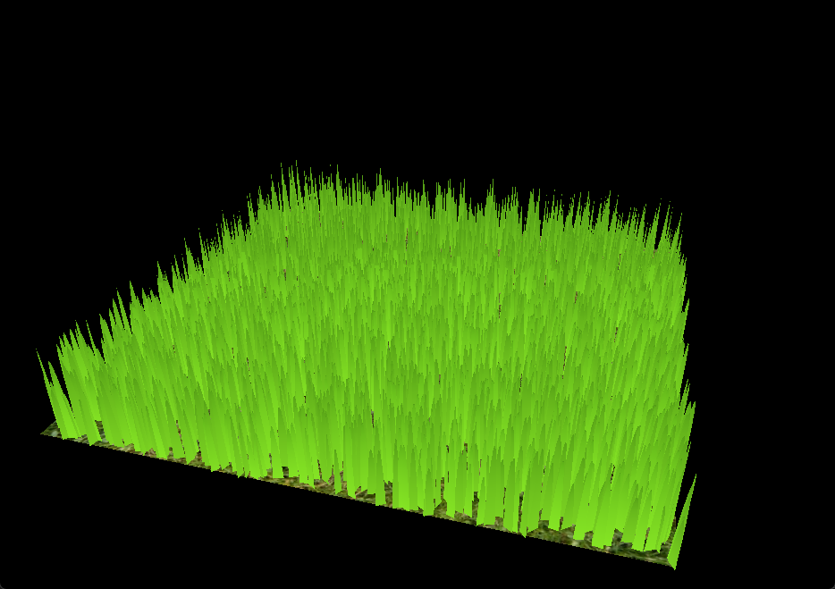
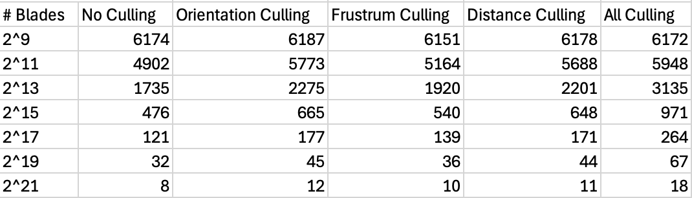
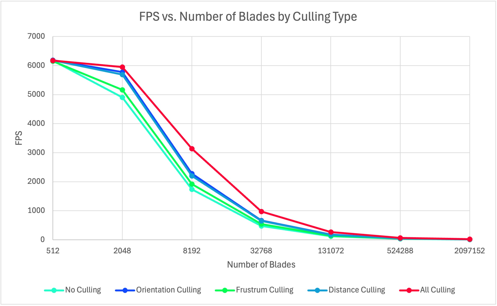

# Vulkan Grass Rendering

========================

**University of Pennsylvania, CIS 5650: GPU Programming and Architecture, Project 5 - Vulkan Grass Rendering**

-   Jordan Hochman
    -   [LinkedIn](https://www.linkedin.com/in/jhochman24), [Personal Website](https://jordanh.xyz), [GitHub](https://github.com/JHawk0224)
-   Tested on: Windows 11, Ryzen 7 5800 @ 3.4GHz 32GB, GeForce RTX 3060 Ti 8GB (Compute Capability: 8.6)

## Welcome to my Vulkan Grass Rendering Project!

In this project, I implemented a grass renderer in Vulkan following this [Responsive Real-Time Grass Rendering for General 3D Scenes](https://www.cg.tuwien.ac.at/research/publications/2017/JAHRMANN-2017-RRTG/JAHRMANN-2017-RRTG-draft.pdf) paper. It models each blade of grass as a triangle affected by 3 forces, gravity, the resistance of the blade, and the wind. More details about the exact implementation of these forces can be found in `INSTRUCTION.md` [here](INSTRUCTION.md).

The image above demonstrates how each blade is broken down.

Note that the FPS cap/framiness of the gif above, and all the ones in this README, is not due to the actual graphics pipeline. This is instead just an actual limit of the gifs FPS as it only has so many frames, but the actual FPS of the simulation is much higher and it appears much smoother in real time. The same is true for all of the other gifs in this README.

I will now walk through the process of creating this and demonstrate images at each stage. First however, I will explain the tunable parameters:

In `Blades.h`:

-   `NUM_BLADES`: The number of grass blades
-   `MIN_HEIGHT`: Minimum height of the randomly generated blades
-   `MAX_HEIGHT`: Maximum height of the randomly generated blades
-   `MIN_WIDTH`: Minimum width of the randomly generated blades
-   `MAX_WIDTH`: Maximum width of the randomly generated blades
-   `MIN_BEND`: Minimum bend of the randomly generated blades
-   `MAX_BEND`: Maximum bend of the randomly generated blades

In `grass.tese`:

-   `BLADE_SHAPE`: Changes the shape of the blades
    -   Use the following values: 0 = square, 1 = triangle, 2 = parabola, 3 = triangle tip

In `grass.tesc`:

-   `MAX_TESSELLATION`: The max tessellation level of detail
-   `MIN_TESSELLATION`: The min tessellation level of detail
-   `TESSELLATION_FALLOFF_DISTANCE`: How fast the tessellation level of detail falls off. After this distance, the level of detail is as small as possible.

In `grass.frag`:

-   `baseColor`: The color at the base of each blade of grass
-   `tipColor`: The color at the tip of each blade of grass

In `compute.comp`:

-   `COMPUTE_FORCES`: A boolean representing if forces should be calculated or not
-   `GRAVITY_DIRECTION`: A normalized vector representing the direction of gravity
-   `GRAVITY_MAGNITUDE`: The magnitude of gravity
-   `BLADE_MASS`: The mass of each blade of grass
-   `WIND_TYPE`: Sets the type of wind
    -   The three values are 0 for random wind, 1 for uniform wind in one direction, and 2 for radial wind about a central point
-   `WIND_MAGNITUDE`: The magnitude of the wind
-   `WIND_FREQUENCY`: The frequency of the wind (how fast it changes with time)
-   `ENABLE_ORIENTATION_CULLING`: Whether or not orientation culling is turned on
-   `ENABLE_FRUSTUM_CULLING`: Whether or not view frustum culling is turned on
-   `ENABLE_DISTANCE_CULLING`: Whether or not distance culling is turned on
-   `ORIENTATION_CULLING_THRESHOLD`: The orientation threshold at which to cull
-   `FRUSTUM_CULLING_PADDING`: The padding added to the frustum during culling
-   `DISTANCE_CULLING_THRESHOLD`: The distance at which culled items are removed
-   `DISTANCE_CULLING_NUM_BUCKETS`: The number of buckets for culling blades

Feel free to tweak any of these if you want to run these yourself!

### Feature Walkthrough

The first thing I implemented was getting the grass blades to display, without any physics calculations or culling. This is what it initially looks like:

Then I added tessellation levels of detail, so the further from the camera, the lower the detail of the blades of grass. Here are a few gifs that demonstrate this:

As you can see, as the camera gets further and further away, the level of detail drops off.

After getting this working, I added the physics simulation. This included forces for gravity, the resistance of the blade, and wind. When implementing this, the wind can actually be any arbitrary function. All that's needed for this function is to compute the direction vector of the wind at any given point for any given time. Then based on this function, it can be applied to all the blades in the scene.

Based on this, I created three wind functions leading to three different wind patterns.

The first is a somewhat random distribution of wind where each point is effectively random. The second is a mostly uniform wind across the entire grid, with some small variation so it looks better. The third is a radial wind pattern, such as with a helicopter or fan. In this one, the wind moves outward from a central position. Here they are side by side:

And a few more with movement:

After implementing the physics calculations, I then added culling. The only one easily visible from these three is distance culling, and you can see a demonstration of it here:

Notice how once the camera is far enough away, the blades are entirely removed. And before that, certain fractions of the blades are removed. This is determined by the number of bins which can be seen in the tunable parameter above.

Finally, after getting all of these working, it was time to play around with the simulation! Here is some nice looking grass that is thin and dense:

And now that same version much much sparser (to see the difference in number of blades):

Finally here are some more interesting grass types I created:

### Performance Analysis

To gauge the performance of my grass blade renderer, I analyzed the FPS with different numbers of blades of grass and different culling options. I chose to test on 2^9, 2^11, 2^13, 2^15, 2^17, 2^19, and 2^21 blades of grass as this offered a wide variety of capabilities and performance measurements from my GPU. For each of these, I tested it with no culling, with each type of culling, and finally with all types of culling. The FPS was measured by taking the average FPS for the first 5 seconds of the rendering.

Here is the raw data, although the details can be found [here](performance-data.xlsx) in `performance-data.xlsx`.

In here, each cell measures FPS, so higher is better. Here is a graph which shows this data more clearly (in log scale):

As you can see based on this graph, it is very clear that as the number of blades increases, the performance decreases. This holds at all measurements of number of blades and for all culling tests.

Another interesting point is that with a very low count of blades (at 2^9 = 512) there was no noticeable difference in the performance between any of the culling options. This is likely because with so few blades, culling a few or not doesn't impact the performance. Most of it just comes from the overhead of setting up the rendering pipeline, and not from rendering the number of blades themselves.

However, as the number of blades increases, the effect of culling becomes more and more apparent. It starts improving the performance by a large margin, and this can be seen in the graph. This makes sense because we would expect that the pipeline has to do much less work when culling since the number of triangles is large.

Another interesting point is that orientation and distance culling mostly outperform view-frustum culling. One explanation for this is that the view-frustum culling can only reduce the number of blades rendered by about a fourth (the FOV over the total screen portion). However, the other two can reduce this by a much larger amount if there are a large number of blades either turned away from the camera or far away respectively. Therefore it makes sense that in the extremes both of these can cull much more than view-frustum culling.
